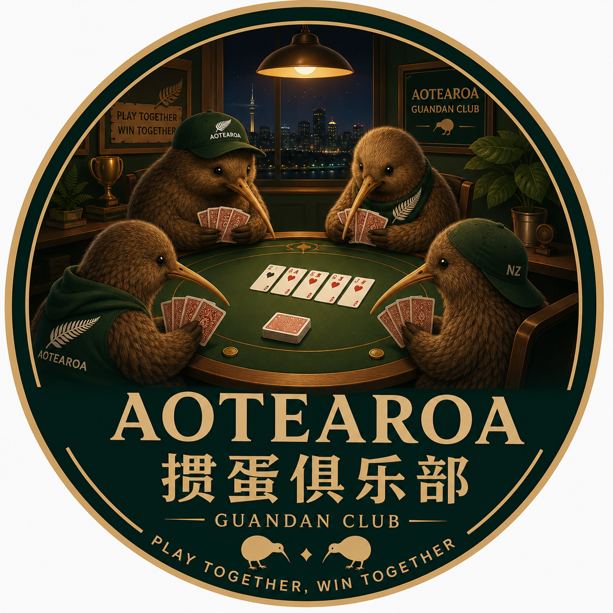
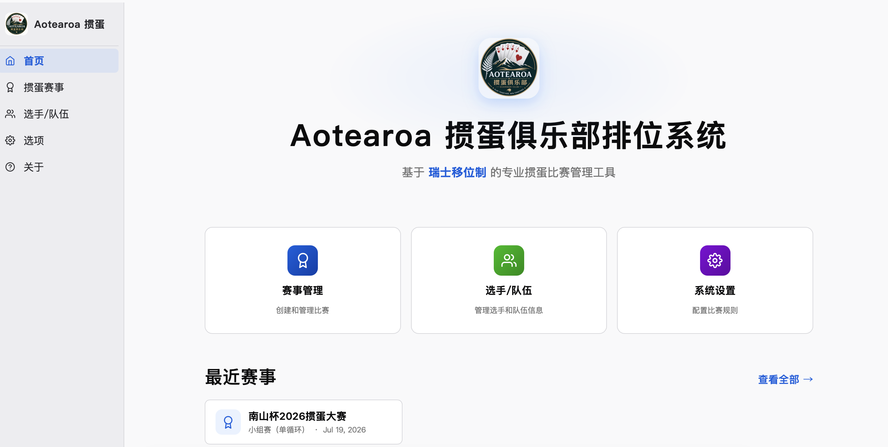
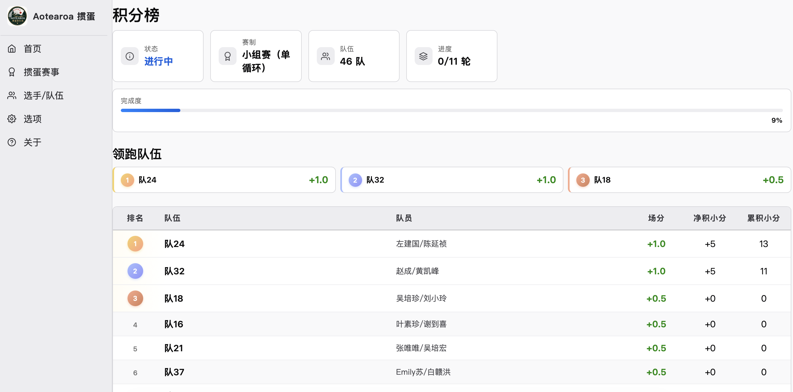
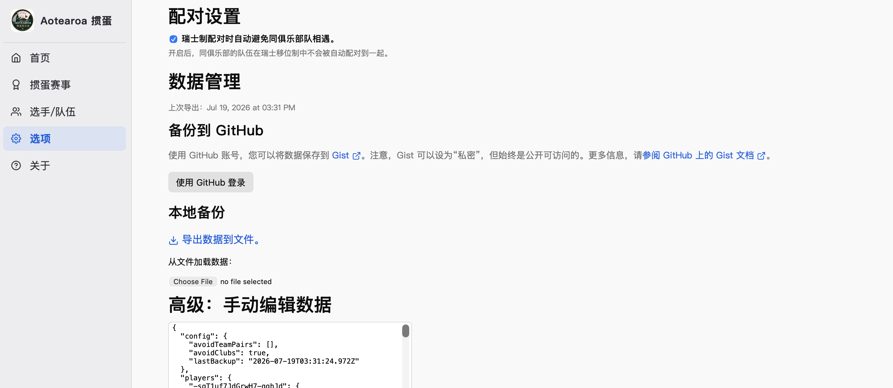

# Aotearoa掼蛋俱乐部排位系统

<p align="center">
  
</p>

<p align="center">
  <strong>基于瑞士移位制的专业掼蛋比赛管理工具</strong>
</p>

<p align="center">
  <a href="https://ai3d.co.nz/guandan/">在线应用</a> ·
  <a href="./docs/usermanual.md">用户手册</a> ·
  <a href="./docs/operation.md">运维手册</a> ·
  <a href="./docs/faq.md">常见问题</a>
</p>

---

## 关于 Aotearoa 掼蛋俱乐部

Aotearoa 掼蛋俱乐部致力于在新西兰推广和普及掼蛋这项中国传统牌类运动。本系统专为俱乐部的周赛、月赛、年度总决赛等各类赛事打造，旨在让比赛组织者从繁琐的人工配对和计分中解放出来，专注于比赛本身。

---

## 功能特性

| 模块 | 功能 |
|------|------|
| **队伍管理** | 双人固定配对，录入选手信息与所属俱乐部，支持 CSV 批量导入，设置回避规则 |
| **三种赛制** | 瑞士移位制（Swiss）、小组单循环赛（Group Stage）、淘汰赛（Knockout） |
| **智能配对** | 瑞士制 Blossom 算法自动配对、小组赛蛇形分组 + 圈圈法排表、淘汰赛种子排位 |
| **手动干预** | 支持手动取消/创建配对，灵活应对比赛中的特殊情况 |
| **级差计分** | 按掼蛋级数（2–A）录入结果，级联式药丸选择器，自动计算场分、净积小分、累积小分 |
| **实时排名** | 多级破同分规则（总积分 → 相互胜负 → 净积小分 → 累积小分），支持排序筛选 |
| **数据安全** | 纯客户端存储（IndexedDB），支持 JSON 导入/导出与 GitHub Gist 云端备份 |
| **跨平台** | 纯 Web 应用，响应式设计，桌面、平板、手机均可使用，无需安装 |

### 赛制对比

| 赛制 | 配对方式 | 理论轮次 | 适用场景 |
|------|----------|----------|----------|
| **瑞士移位制** | Blossom 算法按积分分组配对，避免重复相遇 | ⌈log₂(N)⌉ | 周赛、月赛 |
| **小组单循环** | 蛇形分组，组内单循环（圈圈法排表） | 组内 m−1 轮 | 分组预选赛 |
| **淘汰赛** | 种子排位，标准 bracket 单败淘汰 | log₂(N) | 总决赛、杯赛 |

---

## 快速开始

### 在线使用

访问 **[ai3d.co.nz/guandan](https://ai3d.co.nz/guandan/)** 即可使用，无需注册或安装。

### 本地开发

```bash
# 系统要求：Node.js ≥ 24
git clone https://github.com/NZSpark/guandan.git
cd guandan

# 安装 pnpm（通过 Corepack）
npm install -g corepack
pnpm install

# 终端 1：启动 ReScript 编译器（监视模式）
pnpm run res:dev

# 终端 2：启动 Vite 开发服务器
pnpm run dev
```

开发服务器默认运行于 `http://localhost:3000`。

### 构建生产版本

```bash
pnpm run res:build   # 一次性编译 ReScript
pnpm run build       # Vite 生产构建 → dist/
```

---

## 界面

| 首页 | 配对 | 积分榜 |
|:---:|:---:|:---:|
|  |  |  |

---

## 技术栈

| 层级 | 技术 |
|------|------|
| 语言 | [ReScript](https://rescript-lang.org/) 11 |
| UI 框架 | [React](https://reactjs.org/) 19 |
| 构建工具 | [Vite](https://vitejs.dev/) 7 |
| 包管理 | [pnpm](https://pnpm.io/) |
| 数据存储 | [LocalForage](https://localforage.github.io/localForage/) (IndexedDB) |
| 配对算法 | [rescript-blossom](https://github.com/johnridesabike/rescript-blossom) (Blossom 最大权匹配) |
| 测试 | [Vitest](https://vitest.dev/) |

---

## 计分规则

参照《南山杯 Aotearoa 掼蛋大赛指南（2026）》附录一及《掼蛋（国家）竞赛规则（2017版）》。

**级差计分**：每场比赛双方按最终打到的级数（2–A，A=14）判定胜负。
- 级数高者获胜，两者相当则为平级
- 净积小分 = 己方级数 − 对方级数
- 累积小分 = (己方级数 − 2)，过 A 另加 1 分

**场分**：胜 1 分 / 平 0.5 分 / 负 0 分 / 缺席 −1 分 / 轮空 1 分

**破同分**（优先级从高到低）：
- 海选赛（瑞士制）：总积分 → 对手分 → 胜场数 → 贡献分（累积小分）
- 小组赛（循环制）：总积分 → 相互胜负 → 净积小分 → 累积小分

---

## 文档

- **[用户手册](./docs/usermanual.md)** — 面向比赛组织者的完整操作指南
- **[运维手册](./docs/operation.md)** — 面向开发/运维人员的部署与维护指南
- **[常见问题](./docs/faq.md)** — 常见问题解答

---

## 贡献

欢迎通过以下方式参与贡献：

- [提交 Bug 报告或功能建议](https://github.com/NZSpark/guandan/issues)
- [查看贡献指南](./CONTRIBUTING.md)
- 发送邮件至 spark.zheng@icloud.com

---

## 致谢

- 系统以 [coronate](https://github.com/johnridesabike/coronate)（John Jackson 的国际象棋瑞士制赛事管理器）为基础重构开发
- 开发过程使用 [CodeBuddy](https://www.codebuddy.ai/) 作为 AI 编程助手
- 所有参赛队伍和选手为 Aotearoa 掼蛋俱乐部成员

---

## 许可证

[MPL-2.0](./LICENSE)
