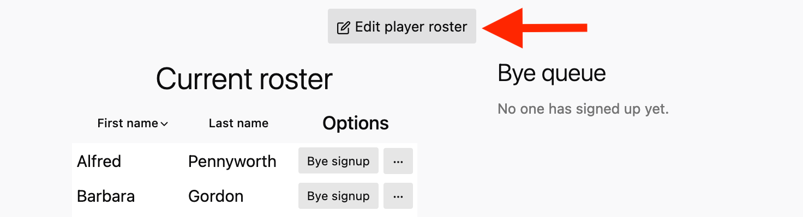
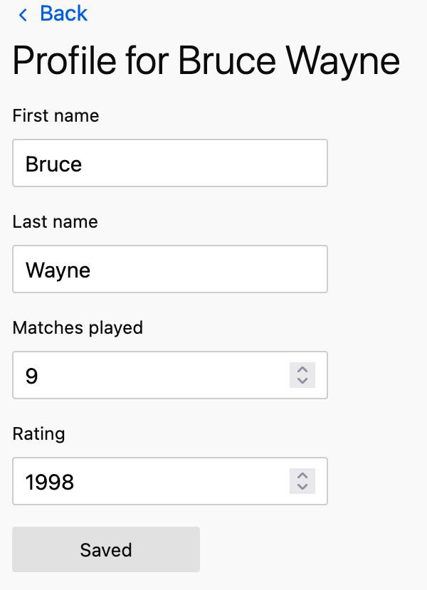
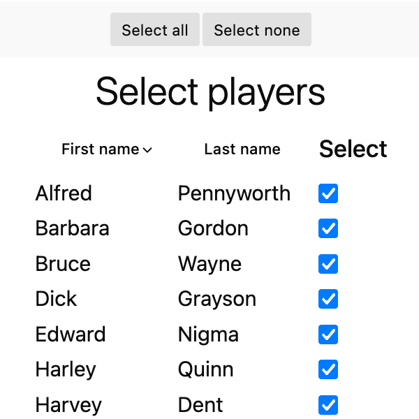
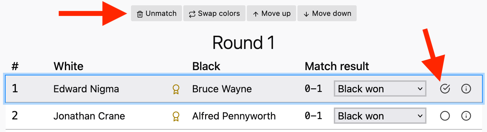
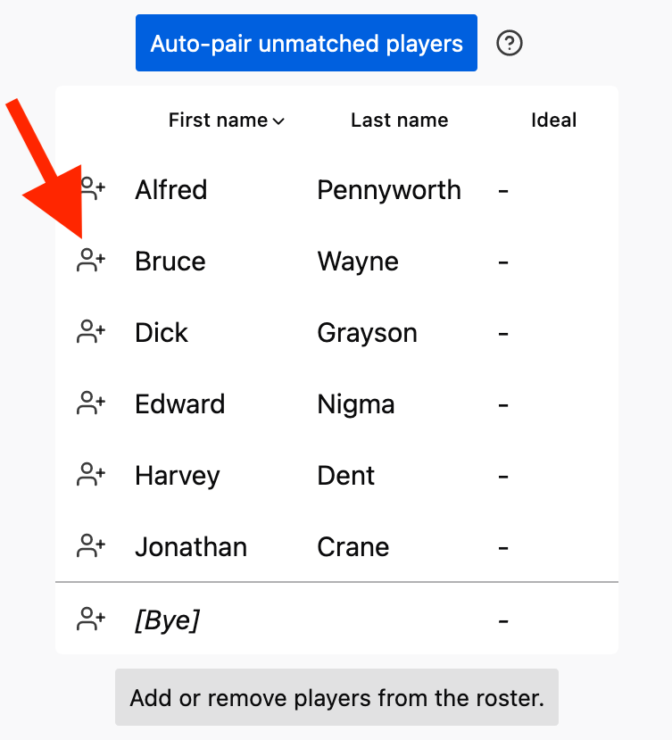
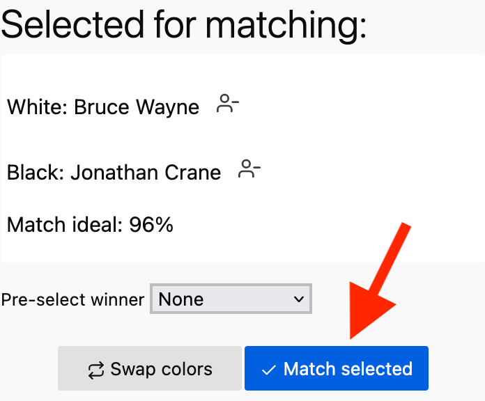
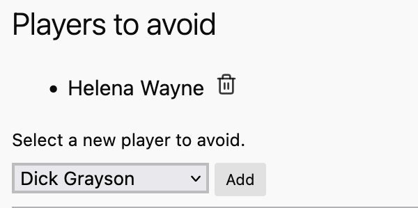
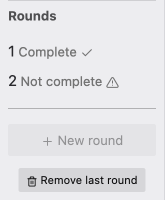

## 在我的电脑上使用这个程序的最简单方法是什么？

访问此链接：[ai3d.co.nz/guandan]。

[ai3d.co.nz/guandan]: https://ai3d.co.nz/guandan/

## 我只能通过浏览器使用这个程序吗？

是的，这样就可以在任何操作系统上使用。

## 我有 Apple / Windows / Linux 电脑，能用 AotearoaGuandan 吗？

可以，使用您喜欢的浏览器即可。

## 我可以在自己的电脑上运行该程序的本地版本吗？

可以，源代码是自由使用的，并且系统依赖最少。
请参阅 README 的[开发部分]了解更多信息。

[开发部分]:
  https://github.com/NZSpark/guandan?tab=readme-ov-file#development

## 如何试用 AotearoaGuandan？

使用"点击此处加载演示数据"按钮获取虚拟锦标赛。您可以删除部分或全部选手，自行添加选手，或更改名称。您甚至可以通过"锦标赛"标签页中的"添加锦标赛"按钮创建全新的空锦标赛。

对于每个锦标赛，您可以选择包含哪些选手或包含"全部"。

无需设定要进行的总轮次数。AotearoaGuandan 使用瑞士制锦标赛规则自动计算后续轮次。

## 我可以用只有 4 个选手进行锦标赛吗？

可以，这也是最低要求。无论选手人数多少，当进行多轮比赛时，程序可能会让一些选手再次配对，但会优先交换颜色。

## 锦标赛中最多能有多少选手？

没有硬性限制。不过到目前为止，我们还没有找到一个会导致程序崩溃的人数。

## 在某些轮次进行后，我还能添加新选手吗？

可以，有时有人想后续加入，这是会发生的。在每个新轮次开始前，您可以向名单添加选手，或取消选择想跳过一轮或离场的选手。



## 我能保存/导出到某一轮的所有结果，之后用它们继续同一个锦标赛吗？

可以，您的所有数据都可以导出到一个 JSON 文件（这是一种常见的开放数据格式）。之后您可以加载该文件，请参见选项页面。

## 我能修改导出的锦标赛 .JSON 文件吗？

不建议这样做。如果您不清楚自己在做什么，可能会损坏锦标赛（JSON）文件。最好通过程序菜单更改任何设置，例如选手姓名。

## 我能更改选手姓名吗？

可以。在主菜单的"选手"标签页中，点击您要编辑的选手，即可在显示的表格上更改姓名。



## 我能从锦标赛中移除选手吗？

可以。在锦标赛界面的"选手"标签页中，点击"编辑选手名单"按钮。从那里，您可以取消勾选要移除的选手。

这会将选手从未来的比赛中排除，但不会影响他们已经参加过的比赛。



## 我能强制/修正配对吗？

可以。在轮次界面中，选择要移除的配对一个或多个，然后点击"取消配对"按钮。然后在"未配对选手"标签页中，手动添加您想要配对的两位选手，点击"确认配对"按钮。







## 我能强制禁止某个配对的选手组合吗？

可以。在首页的"选手"标签页中，选择其中一位选手。然后在"回避选手"下拉菜单中找到另一位选手，点击"添加"以强制他们互相回避。

这实际上将确保他们永远不会配对。但在极端情况下（例如其他所有选手也被设置为回避他们），仍可能人为地强制他们配对。



## 锦标赛中可以有分组吗？

不可以，此功能尚未实现。

## 等级分是如何根据比赛结果计算的？

如果等级分为 `r1` 的选手在对阵等级分为 `r2` 的选手时获得 `s` 分，且已赛场数为 `c`，则：

```
k_factor = 如果 c < 30 则为 40，否则如果 r1 > 2100 则为 10，否则为 20
expected = 1 / (1 + 10 ^ ((r2 - r1) / 400))
new_rating = r1 + k_factor * (s - expected)
```

得分 `s`：如果选手获胜为 `1`，失败为 `0`，平局为 `1/2`。

这些公式是我从 Wikipedia 复制的，对于小型锦标赛来说是最佳尝试。我不建议将 AotearoaGuandan 作为权威的等级分计算器。

## 如何为我的锦标赛设置轮次数？

瑞士制会根据您的选手人数自动设定轮次数。不过，您也可以手动添加额外的轮次。

## 自动配对是如何完成的？

AotearoaGuandan 使用瑞士制。它会自动计算最高效的一系列配对，以便在最少轮次内确定冠军。它主要根据选手在以往轮次中的得分进行配对，并避免任何两名选手再次相遇。

为了使瑞士制生效，AotearoaGuandan 主要根据选手的得分进行配对。它也会参考等级分并尽量平衡每位选手的"执白"和"执黑"次数，但这些权重较低。

如果您不喜欢自动配对，也可以手动配对选手。

## 如何查看以往轮次的结果？

在锦标赛界面中，点击侧边栏"轮次"下列出的各个编号轮次。



## 如何查看当前排名？

在锦标赛界面中，点击侧边栏中的"得分明细"。

## 我能打印当前界面吗？

不能，程序内部没有打印功能，但您的浏览器可以打印任何（基于 Web 的）页面，也可以创建（PDF）文件。

## 我能撤销/删除一整轮吗？

您可以通过锦标赛界面中的"删除最后一轮"按钮来删除最近一轮。要删除更早的轮次，必须先删除其后的轮次。

## 我能禁止等级分差距很大的选手配对吗？

通常这是自动完成的，程序会根据等级分和迄今为止的比赛结果，始终找到最合适的对手。

## 我能调整自动配对的方式吗？我国家的瑞士制规则有所不同。

不能，AotearoaGuandan 使用一套硬编码的规则，目前尚不可自定义。
